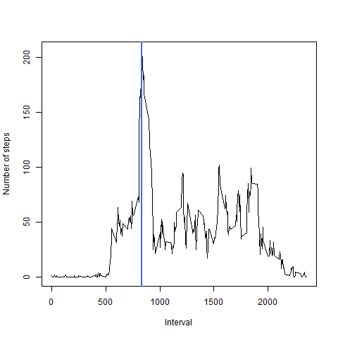
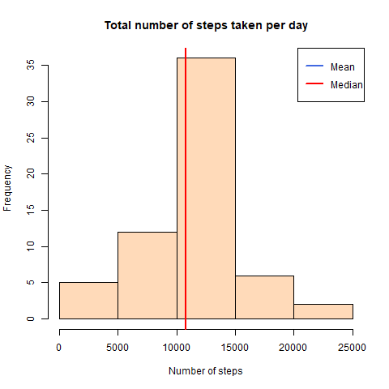

---
title: "Reproducible Research: Peer Assessment 1"
output: 
  html_document:
    keep_md: true
---


# Loading and preprocessing the data  
This part of the code loads the necessary libraries, downloads, unzips and reads the data from the .csv file and saves it as the dataframe. For the sake of the futher analysis I change the format of the "date" variable to the POSIXct date format. 

```r
# set working directories and load necessary libraries
setwd("C:\\Users\\frost\\Documents\\DataScience")
library(dplyr)
```

```
## Warning: package 'dplyr' was built under R version 3.4.2
```

```
## 
## Attaching package: 'dplyr'
```

```
## The following objects are masked from 'package:stats':
## 
##     filter, lag
```

```
## The following objects are masked from 'package:base':
## 
##     intersect, setdiff, setequal, union
```

```r
library(lattice)
```

```
## Warning: package 'lattice' was built under R version 3.4.4
```

```r
## download file if it doesn't exist yet
fileUrl <- "https://d396qusza40orc.cloudfront.net/repdata%2Fdata%2Factivity.zip"
if (!file.exists("activity.zip")){
  download.file(fileUrl,destfile="activity.zip")	
}
# get the name of the only zip file in the folder
fname<-dir(pattern="\\.zip$")
# unzip file
unzip(fname,exdir = "C:\\Users\\frost\\Documents\\DataScience")

# create the dataframe
ActivityData<-read.csv(file="activity.csv", header=TRUE, sep=",")
# change the date format
ActivityData$date<-as.POSIXct(ActivityData$date,format='%Y-%m-%d')
summary(ActivityData)
```

```
##      steps             date                        interval     
##  Min.   :  0.00   Min.   :2012-10-01 00:00:00   Min.   :   0.0  
##  1st Qu.:  0.00   1st Qu.:2012-10-16 00:00:00   1st Qu.: 588.8  
##  Median :  0.00   Median :2012-10-31 00:00:00   Median :1177.5  
##  Mean   : 37.38   Mean   :2012-10-30 23:32:27   Mean   :1177.5  
##  3rd Qu.: 12.00   3rd Qu.:2012-11-15 00:00:00   3rd Qu.:1766.2  
##  Max.   :806.00   Max.   :2012-11-30 00:00:00   Max.   :2355.0  
##  NA's   :2304
```
# What is mean total number of steps taken per day?
This part of the code creates the dataframe that contains the **total** number of steps taken per day (ignoring the missing values) and creates the histogram of the total number of steps. Two horizontal lines define the **mean** and the **median** of the total number of steps taken per day. The corresponding values of the mean and the median total number of steps are given after the histogram together with the code generated these statistics.

```r
# Calcuate the total number of steps taken each day
DailyActivity<-group_by(ActivityData,ActivityData$date)
```

```
## Warning: package 'bindrcpp' was built under R version 3.4.2
```

```r
DailySummary<-summarize(DailyActivity,TotalSteps=sum(steps,na.rm=TRUE))
# Create the histogram of the total steps
hist(DailySummary$TotalSteps,
     col="peachpuff",
     border="black",
     xlab="Number of steps",
     main="Total number of steps taken per day")
abline(v=mean(DailySummary$TotalSteps,na.rm=TRUE),
       col="royalblue",
       lwd=2)
abline(v=median(DailySummary$TotalSteps,na.rm=TRUE),
       col="red",
       lwd=2)
legend(x="topright",
       c("Mean","Median"),
       col=c("royalblue","red"),
       lwd=c(2,2))
```


```r
## copy the histogram to a png file
dev.copy(png,file="histogram.png",width=480,height=480)
```

```
## png 
##   3
```

```r
## close the png device
dev.off()
```

```
## png 
##   2
```
<!-- -->
  
  
##Mean total number of steps:

```r
mean1<-mean(DailySummary$TotalSteps,na.rm=TRUE)
```
9354.2295082
  
  
##Median total number of steps:

```r
median1<-median(DailySummary$TotalSteps,na.rm=TRUE)
```
10395

# What is the average daily activity pattern?

This part of the code creates the dataframe with the average number of steps taken within particular 5-minute intervals, what allows to check average intradaily activity of a person. 


```r
# Calcuate the average number of steps taken within 5-minute intervals
IntradailyActivity<-group_by(ActivityData,ActivityData$interval)
IntradailySummary<-summarize(IntradailyActivity,AverageSteps=mean(steps,na.rm=TRUE))
# Find the interval within which the maximum number of steps was made on average
IntervalMaxSteps<-filter(IntradailySummary,AverageSteps==max(AverageSteps))

# Create the time series plot of the average number of steps
plot(IntradailySummary$`ActivityData$interval`,IntradailySummary$AverageSteps,type='l',ylab="Number of steps",xlab="Interval")
# add the vertical line to show the interval with the maximum averaged number of steps
abline(v=IntervalMaxSteps[1],
       col="royalblue",
       lwd=2)
```


```r
## copy the histogram to a png file
dev.copy(png,file="TimeSeriesPlot.png",width=480,height=480)
```

```
## png 
##   3
```

```r
## close the png device
dev.off()
```

```
## png 
##   2
```
<!-- -->
  
  
##The indicator of the 5-minute interval that, on average across all the days in the dataset, contains the maximum number of steps:

```r
interval<-IntervalMaxSteps[1]
```
835  

# Imputing missing values
The whole dataset contains the following number of missing values (i.e. the total number of rows with NAs):


```r
MissingValues<-nrow(ActivityData)-nrow(ActivityData[complete.cases(ActivityData),])
MissingValues
```

```
## [1] 2304
```
2304

In order to cope with the problem of missing values we fill in the missing values with the mean for a corresponding 5-minute interval and create a new dataset.


```r
# plug in instead of the missing values the average number of steps for a corresponding interval from the IntradailySummary dataframe
ActivityData$steps[is.na(ActivityData$steps)]<-IntradailySummary$AverageSteps[match(ActivityData$interval[is.na(ActivityData$steps)],IntradailySummary$`ActivityData$interval`)]
```

The histogram of the total number of steps taken each day and the mean and median total number of steps taken per day are given below:

```r
# Calcuate the total number of steps taken each day
DailyActivityNew<-group_by(ActivityData,ActivityData$date)
DailySummaryNew<-summarize(DailyActivityNew,TotalSteps=sum(steps,na.rm=TRUE),AverageSteps=mean(steps,na.rm=TRUE))
# Create the histogram of the total steps
hist(DailySummaryNew$TotalSteps,
     col="peachpuff",
     border="black",
     xlab="Number of steps",
     main="Total number of steps taken per day")
abline(v=mean(DailySummaryNew$TotalSteps),
       col="royalblue",
       lwd=2)
abline(v=median(DailySummaryNew$TotalSteps),
       col="red",
       lwd=2)
legend(x="topright",
       c("Mean","Median"),
       col=c("royalblue","red"),
       lwd=c(2,2))
```


```r
## copy the histogram to a png file
dev.copy(png,file="histogramNew.png",width=480,height=480)
```

```
## png 
##   3
```

```r
## close the png device
dev.off()
```

```
## png 
##   2
```
<!-- -->

# Mean total number of steps for the new dataset:

```r
mean2<-mean(DailySummaryNew$TotalSteps)
```
1.0766189\times 10^{4}

# Median total number of steps for the new dataset:

```r
median2<-median(DailySummaryNew$TotalSteps)
```
1.0766189\times 10^{4}   
**Conclusion:**  

As we can see from the histogram and the descriprive statistics of the total number of steps taken per day our strategy of filling in the missing data increases the estimates of the mean and meadian of total daily number of steps.  


# Are there differences in activity patterns between weekdays and weekends?

The following part of the code creates a new factor variable in the dataset with two levels - "weekday" and "weekend" indicating whether a given date is a weekday or weekend day.


```r
# create a new variable that shows whether the corresponding day is the weekend or not in the new dataframe with filled in missing data 
#create a vector of weekdays
weekdaysnames <- c('Monday', 'Tuesday', 'Wednesday', 'Thursday', 'Friday')
ActivityData$day<-factor((weekdays(ActivityData$date) %in% weekdaysnames), 
         levels=c(FALSE, TRUE), labels=c('weekend', 'weekday')) 
```


Below I provide a panel plot containing a time series plot (i.e. type = "l") of the 5-minute interval (x-axis) and the average number of steps taken, averaged across all weekday days or weekend days (y-axis) to represent how the activity patterns differ between weekdays and weekends.

```r
# Calcuate the average number of steps taken within 5-minute intervals for weekdays and for weekends
IntradailyActivity<-group_by(ActivityData,ActivityData$day, ActivityData$interval)
IntradailySummary<-summarize(IntradailyActivity,AverageSteps=mean(steps,na.rm=TRUE))


# Create the time series plot of the average number of steps

xyplot(IntradailySummary$AverageSteps~IntradailySummary$`ActivityData$interval`|factor(IntradailySummary$`ActivityData$day`),
       type='l',layout=c(1,2),
       xlab='Interval',ylab='Number of Steps')
```


```r
## copy the histogram to a png file
dev.copy(png,file="WeekPattern.png",width=480,height=480)
```

```
## png 
##   3
```

```r
## close the png device
dev.off()
```

```
## png 
##   2
```
<!-- -->
